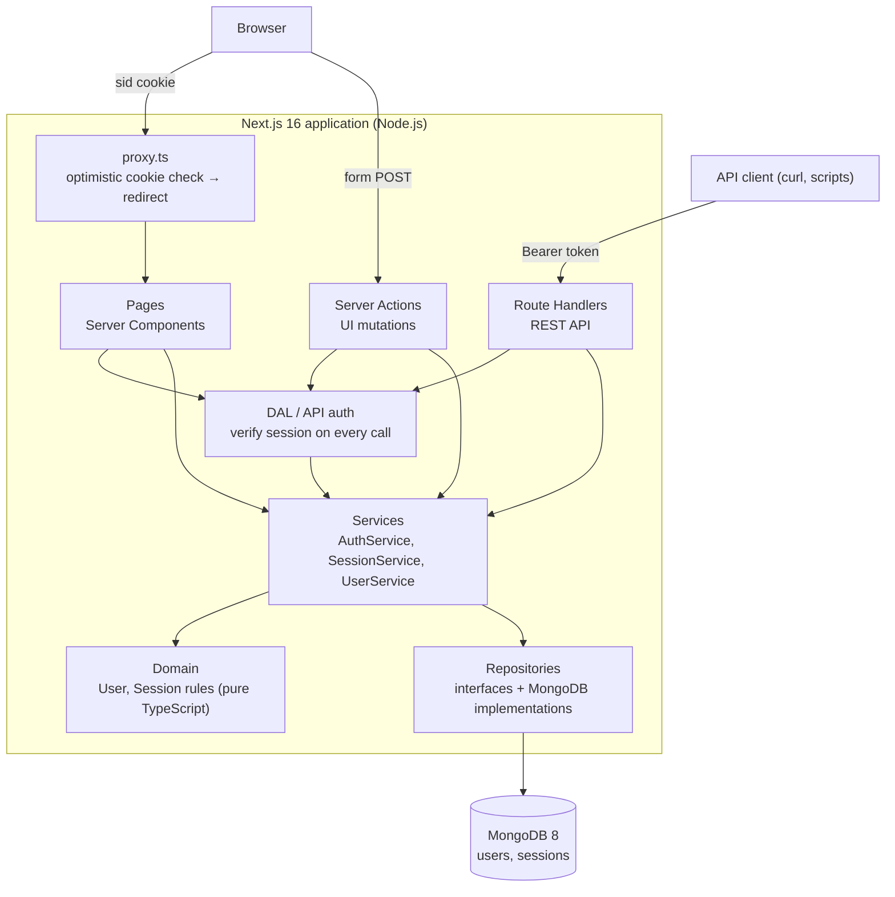
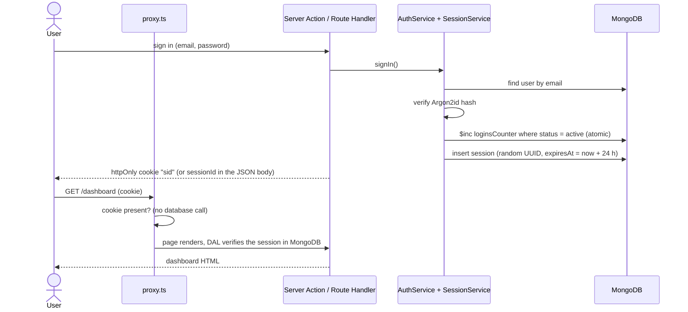

# User Admin

[](https://github.com/Ajjya/user-admin-demo/actions/workflows/ci.yml)

A small back-office application where an administrator signs up, signs in and manages platform
users. One Next.js application serves both the UI and a REST API, backed by MongoDB, and the whole
stack starts with one Docker command.

- [Requirements](#requirements)
- [Quick start (Docker)](#quick-start-docker)
- [Local development](#local-development)
- [Running tests](#running-tests)
- [Continuous integration](#continuous-integration)
- [Features](#features)
- [Architecture](#architecture)
- [Project structure](#project-structure)
- [API reference](#api-reference)
- [Data model](#data-model)
- [Decisions and trade-offs](#decisions-and-trade-offs)
- [Assumptions](#assumptions)
- [Security notes](#security-notes)
- [Deployment](#deployment)
- [Future improvements](#future-improvements)
- [Known limitations](#known-limitations)

## Requirements

| Tool | Version | Where it is pinned |
|---|---|---|
| Node.js | 22 or newer (developed and shipped on **26**) | `package.json` `engines`, `.nvmrc`, `Dockerfile` (`node:26-alpine`) |
| TypeScript | 5.x, `strict: true` | `package.json`, `tsconfig.json` |
| Next.js | 16.4 (App Router) | `package.json` |
| React | 19.3 | `package.json` |
| Playwright | 1.64 | `package.json` |
| MongoDB | 8 | `docker/mongo/Dockerfile` (`mongo:8`) |
| Yarn | 1.22.22 (Classic) | `package.json` `packageManager` |
| Docker | with Compose v2 | needed only for the containerized run |

Node.js 25+ no longer ships Corepack. To get the pinned Yarn version, install it once:

```bash
npm install --global corepack@latest && corepack enable
```

## Quick start (Docker)

Starts MongoDB and the app; nothing else needs to be installed.

```bash
cp .env.example .env
```

```bash
docker compose up --build
```

Open <http://localhost:3000>. The root URL shows the sign-up page; create an account and you land
on the dashboard. Both containers report `healthy` in `docker compose ps` once they are ready.

| Command | Effect |
|---|---|
| `docker compose up -d --build` | Same, in the background |
| `docker compose logs -f app` | Follow the app's JSON logs (one line per API request) |
| `docker compose down` | Stop; the data stays in the `mongo-data` volume |
| `docker compose down -v` | Stop and **delete the data**; MongoDB is initialized again on the next start |

### Demo data (optional)

To start with a populated dashboard, set this in `.env` **before the first start** (or after
`docker compose down -v`):

```
SEED_DEMO_DATA=true
SEED_ADMIN_PASSWORD=<at least 8 characters>
```

On startup the app then creates `admin@example.com` (sign in with `SEED_ADMIN_PASSWORD`) and 20
users, two of them inactive, so pagination shows four pages. The 20 users get the same password as
a temporary one: signing in as any of them shows the forced password change. The seed runs only
when the database has no users, so it never mixes into real data and does nothing on restarts. With
`SEED_DEMO_DATA=true` and no valid password the app refuses to start.

### What happens on `docker compose up`

1. Compose reads `.env` and builds two images: our MongoDB image (`docker/mongo`) and the app
   image (multi-stage `Dockerfile`, standalone Next.js output, non-root user).
2. On the **first start with an empty volume**, the MongoDB image creates the root user, then runs
   its init scripts: `01-app-user.js` creates a least-privilege application user (`readWrite` on
   the application database only) and `02-indexes.js` creates the indexes.
3. MongoDB becomes `healthy` only when the real server accepts the application user over the
   network. The app container waits for that (`depends_on: service_healthy`).
4. The app starts, ensures the indexes again (idempotent), optionally creates the demo data, and
   answers on port 3000. MongoDB's port is **not** published to the host.

### MongoDB credentials

There are no built-in passwords: you choose them in `.env` (git-ignored; `.env.example` holds
placeholders).

| Variable | Used by |
|---|---|
| `MONGO_ROOT_USERNAME`, `MONGO_ROOT_PASSWORD` | MongoDB, on the first start only, to create the superuser |
| `MONGO_APP_DB`, `MONGO_APP_USERNAME`, `MONGO_APP_PASSWORD` | MongoDB init (creates the app user) and Compose (builds the app's `MONGODB_URI`) |

- Use URL-safe passwords (letters, digits, `-`, `_`, `.`): they are embedded in a connection
  string. `openssl rand -hex 16` generates a good one.
- Users are created **once**, when the volume is empty. After changing the passwords in `.env`,
  either reset the database with `docker compose down -v`, or keep the data and change the password
  inside MongoDB first:

  ```bash
  docker compose exec mongo mongosh -u root -p <root-password> --authenticationDatabase admin \
    --eval 'db.getSiblingDB("user_admin").changeUserPassword("user_admin_app", "<new-password>")'
  ```

  then update `.env` and run `docker compose up -d`.
- Open a shell as the application user:

  ```bash
  docker compose exec mongo mongosh -u user_admin_app -p <app-password> --authenticationDatabase user_admin user_admin
  ```

## Local development

`yarn dev` (hot reload) runs the app on the host and needs a reachable MongoDB.

```bash
yarn install
```

Point the app at a database in `.env` or `.env.local` (both git-ignored; Next.js loads them):

| Variable | Default | Purpose |
|---|---|---|
| `MONGODB_URI` | required | Connection string |
| `MONGODB_DB` | `user_admin` | Database name |
| `SESSION_TTL_HOURS` | `24` | Absolute session lifetime |
| `LOG_LEVEL` | `info` | pino log level (`silent` in tests) |
| `SEED_DEMO_DATA` | `false` | Create demo data on startup if the database has no users |
| `SEED_ADMIN_PASSWORD` | – | Password of the demo admin; required when `SEED_DEMO_DATA=true` |

Either use any local MongoDB, for example one installed with Homebrew:

```
MONGODB_URI=mongodb://127.0.0.1:27017
MONGODB_DB=user_admin_dev
```

or reuse the Docker MongoDB: uncomment its `ports` mapping in `docker-compose.yml`, start only that
service with `docker compose up -d mongo`, and use

```
MONGODB_URI=mongodb://user_admin_app:<app-password>@localhost:27017/user_admin?authSource=user_admin
```

If another MongoDB already uses port 27017 on your machine, map `"27018:27017"` instead and use
port 27018 in the URI.

Then:

```bash
yarn dev
```

| Script | Purpose |
|---|---|
| `yarn dev` | Development server with hot reload |
| `yarn build` / `yarn start` | Production build / server |
| `yarn lint` | ESLint |
| `yarn typecheck` | `next typegen` (route types) + `tsc --noEmit` |

## Running tests

| Command | What it runs |
|---|---|
| `yarn test` | Unit + integration tests (Vitest) |
| `yarn test:unit` | Domain, schemas, services with in-memory fakes, HTTP edge cases |
| `yarn test:integration` | Repositories, services and Route Handlers against a real `mongod` |
| `yarn test:coverage` | All of the above, failing below 80% coverage of `src/domain` and `src/server/services` |
| `yarn test:e2e` | Production build, then Playwright in Chromium |

- **No Docker needed.** Integration and e2e tests start an in-memory MongoDB with
  `mongodb-memory-server` (a real `mongod` 8 binary, downloaded once and cached).
- Before the first e2e run, install the browser: `yarn playwright install chromium`.
- E2E tests run against the same standalone `server.js` the Docker image ships, with a fresh
  database per run. Every test creates its own users (unique emails), so tests are independent and
  run in parallel. The pagination spec asserts the global newest-first order, so it runs in a
  separate Playwright project after the others, with a single worker.

| Behaviour | Covered by |
|---|---|
| Domain rules (createdAt immutable, updatedAt always set, no rename while inactive, inactive users cannot start sessions) | `tests/unit/domain` |
| Service rules (soft delete, self-protection, temporary passwords, session revocation) | `tests/unit/services`, `tests/integration/services` |
| Every API status code and error format | `tests/integration/api` |
| Sign-up/sign-in/log out, redirects, password mismatch blocked before the request | `e2e/auth.spec.ts` |
| Forced password change | `e2e/change-password.spec.ts` |
| Pagination (6 per page, page size, URL state) | `e2e/dashboard-pagination.spec.ts` |
| Create/update/delete, rename blocked for inactive users, revoked sessions | `e2e/users-crud.spec.ts` |
| Theme choice persists after reload and in a new page | `e2e/theme.spec.ts` |

## Continuous integration

GitHub Actions (`.github/workflows/ci.yml`) runs on every push to `main` and on pull requests, on
Node.js 26:

| Job | Steps |
|---|---|
| Lint, typecheck, tests, e2e | frozen install → `yarn lint` → `yarn typecheck` → `yarn test:coverage` (fails below the coverage threshold) → `yarn test:e2e`; the Playwright report is uploaded when it fails |
| Docker smoke test | `docker compose up --build --wait` with `.env.example`, then health check, sign-up and an authenticated API call; container logs are printed when it fails |

The Yarn cache, the `mongod` binary used by the in-memory MongoDB and the Playwright browser are
cached between runs. A newer push to the same branch cancels the run still in progress.

## Features

- **Sign-up / sign-in.** With no active session, `/` shows sign-up; the two pages link to each
  other. Sign-up asks for the password twice and the browser checks they match **before** anything
  is sent (the server checks again). After sign-up or sign-in a session is created and the user lands
  on the dashboard. Log out terminates the session and shows the sign-in page.
- **Dashboard** (any signed-in user is an administrator): "Hello, {first name}" header, users table
  with server-side pagination (6 per page by default; 12 or 24 selectable; page and size in the
  URL), create / edit / delete in dialogs.
- **Temporary passwords.** A user created by an admin (or whose password an admin resets) must
  choose their own password after signing in; until then every other page and API call is blocked.
- **Theme.** Light, dark or system; the choice is stored in `localStorage` and applied before the
  first paint, so a reload never flashes the wrong theme.
- **REST API** for every operation, usable by non-browser clients with a Bearer token.

## Architecture



- **Layers.** `src/domain` holds the business rules as pure functions and imports nothing.
  `src/server/services` loads data through repository interfaces, applies the domain rules and
  persists. Pages, Server Actions and Route Handlers are thin: validate with zod, authenticate,
  call a service, map the result. Nothing below the edge imports Next.js, so the API could be
  extracted into a standalone service.
- **Server and Client Components.** Pages are Server Components: they check the session and query
  MongoDB through the services directly, so the HTML arrives with data and no client-side fetching
  is needed. Client Components exist only where interactivity is needed: forms (`useActionState`),
  dialogs, the table's controls and the theme toggle. MUI's providers are the single client
  boundary for styling.
- **Two entry points, one core.** The UI mutates through Server Actions and external clients use
  the REST API; both call the same services with the same zod schemas.

### Authentication flow



Three checkpoints: `proxy.ts` only checks that the cookie **exists** (it runs on every request,
including prefetches, so it never touches the database); the Data Access Layer
(`src/server/auth/dal.ts`) verifies the session in MongoDB in every page and Server Action;
`src/server/http/auth.ts` does the same for the REST API. A stale cookie is sent to
`/sign-in?expired=1`, which the proxy lets through, so the two checks can never redirect in a loop.

## Project structure

```
src/
  app/                    Next.js routes
    (auth)/               sign-in, sign-up pages + their Server Actions (route group, no URL segment)
    change-password/      forced password change page + action
    dashboard/            users table page + create/update/delete actions
    api/                  REST Route Handlers
  components/             Client Components (forms, dialogs, table, theme toggle, providers)
  domain/                 pure business rules: user.ts, session.ts, errors.ts
  server/                 server-only code
    auth/                 session cookie helpers, Data Access Layer
    db/                   MongoClient singleton, collections, indexes
    forms/                Server Action error mapping
    http/                 API error mapping, authentication, request parsing
    repositories/         repository interfaces + MongoDB implementations
    security/             Argon2id password hashing
    services/             AuthService, SessionService, UserService, composition root
    seed.ts               optional demo data
  shared/                 zod schemas and form state shared by server and client
  theme/                  MUI theme (light/dark color schemes)
  instrumentation.ts      startup hook: ensure indexes, optional demo data
  proxy.ts                optimistic redirects (Next.js 16 name for middleware)
tests/unit/               Vitest, in-memory fakes, no database
tests/integration/        Vitest against mongodb-memory-server
e2e/                      Playwright specs, fixtures, test server
docker/mongo/             MongoDB image: Dockerfile + init scripts
Dockerfile                app image
docker-compose.yml        mongo + app
```

## API reference

JSON in and out. Authenticated endpoints accept the session id as `Authorization: Bearer <sessionId>`
(non-browser clients) or the `sid` cookie (browser).

| Method and path | Auth | Request body / query | Success | Errors |
|---|---|---|---|---|
| `GET /api/health` | – | – | `200 {"status":"ok"}` | `503` |
| `POST /api/auth/sign-up` | – | `{firstName, lastName, email, password}` | `201 {sessionId, expiresAt, user}` + cookie | `400`, `409 EMAIL_TAKEN` |
| `POST /api/sessions` (sign in) | – | `{email, password}` | `201 {sessionId, expiresAt, user}` + cookie | `400`, `401 INVALID_CREDENTIALS`, `403 USER_INACTIVE` |
| `DELETE /api/sessions/:id` (log out) | yes¹ | – | `204` | `401`, `404 SESSION_NOT_FOUND` |
| `POST /api/auth/change-password` | yes¹ | `{newPassword}` | `200 {user}` | `400`, `401`, `409 PASSWORD_CHANGE_NOT_REQUIRED`, `422 PASSWORD_UNCHANGED` |
| `GET /api/users?page=1&pageSize=6` | yes | `page ≥ 1`, `pageSize` ∈ 6, 12, 24 | `200 {items, page, pageSize, total, totalPages}` | `400`, `401`, `403 PASSWORD_CHANGE_REQUIRED` |
| `POST /api/users` | yes | `{firstName, lastName, email, password, status?}` | `201 {user}` | `400`, `401`, `403`, `409 EMAIL_TAKEN` |
| `PATCH /api/users/:id` | yes | any of `{firstName, lastName, status, password}` | `200 {user}` | `400`, `401`, `403`, `404 USER_NOT_FOUND`, `422 USER_INACTIVE_RENAME` / `CANNOT_MODIFY_SELF` |
| `DELETE /api/users/:id` | yes | – | `204` | `401`, `403`, `404`, `422 CANNOT_MODIFY_SELF` |

¹ Also allowed while a temporary password is pending; every other authenticated endpoint answers
`403 PASSWORD_CHANGE_REQUIRED` until the password is changed.

- `user` is `{id, firstName, lastName, email, status, loginsCounter, mustChangePassword, createdAt, updatedAt}`;
  the password hash is never returned.
- Lists are sorted newest first; a page past the end returns the last page.
- Bodies are strict: unknown fields (including `createdAt` or `email` on update) are a `400`.
- Errors: `{"error": {"code": "USER_INACTIVE_RENAME", "message": "...", "details"?: [{"path", "message"}]}}`.
  Unexpected errors return a generic `500 INTERNAL_ERROR`; the `x-request-id` response header
  matches the server log line.

Example session:

```bash
B=http://localhost:3000
SID=$(curl -s -X POST $B/api/auth/sign-up -H 'content-type: application/json' \
  -d '{"firstName":"Ada","lastName":"Lovelace","email":"ada@example.com","password":"correct-horse"}' \
  | node -pe 'JSON.parse(require("fs").readFileSync(0)).sessionId')

curl -s -X POST $B/api/users -H "authorization: Bearer $SID" -H 'content-type: application/json' \
  -d '{"firstName":"Grace","lastName":"Hopper","email":"grace@example.com","password":"temporary-pass"}'

curl -s "$B/api/users?page=1&pageSize=6" -H "authorization: Bearer $SID"

curl -s -X DELETE $B/api/sessions/$SID -H "authorization: Bearer $SID" -o /dev/null -w '%{http_code}\n'
```

## Data model

**users**

| Field | Type | Notes |
|---|---|---|
| `_id` | string | random UUID |
| `firstName`, `lastName` | string | 1–50 characters, trimmed |
| `email` | string | trimmed and lowercased; unique (deleted users included) |
| `passwordHash` | string | Argon2id (PHC string with salt and parameters) |
| `status` | `active` \| `inactive` | |
| `loginsCounter` | number | incremented atomically on every session creation |
| `mustChangePassword` | boolean | true while an admin-set temporary password is pending |
| `createdAt` | Date | never changes |
| `updatedAt` | Date | set on every update |
| `deletedAt` | Date \| null | soft delete |

**sessions**

| Field | Type | Notes |
|---|---|---|
| `_id` | string | random UUID; the session identifier, cookie value and Bearer token |
| `userId` | string | |
| `createdAt` | Date | |
| `expiresAt` | Date | `createdAt` + `SESSION_TTL_HOURS` (absolute) |
| `terminatedAt` | Date \| null | set by log out, deactivation, deletion or a password reset |

A session is active while `terminatedAt` is null, `expiresAt` is in the future, and its user is
active and not deleted.

**Indexes** (created by the MongoDB image and again, idempotently, at app startup):

| Collection | Index | Purpose |
|---|---|---|
| users | `{email: 1}` unique | race-safe email uniqueness |
| users | `{deletedAt: 1, createdAt: -1, _id: -1}` | paginated list of non-deleted users; `_id` keeps pages stable when timestamps are equal |
| sessions | `{userId: 1, terminatedAt: 1}` | terminate all active sessions of a user |

## Decisions and trade-offs

| Decision | Why | Alternatives considered |
|---|---|---|
| One Next.js app (UI + REST API) | One deployable for a 2-day delivery; Server Actions call services in-process | Separate NestJS/Express API: cleaner separation, but two apps, CORS and duplicated auth |
| Layered: domain → services → repositories | Rules are unit-tested without a database and shared by the API and the UI | Logic in handlers: rules would be duplicated between Server Actions and Route Handlers |
| Pure functions for the domain | Plain objects map directly to MongoDB documents; trivial to test | Rich entity classes: familiar, but need mapping to and from persistence |
| Official `mongodb` driver, no ODM | Fewer layers; schemas live in zod and TypeScript | Mongoose: second schema system next to zod |
| UUID string ids | Unguessable (required for session ids); no `ObjectId` in the domain | `ObjectId`: partly predictable, MongoDB type leaks into the domain |
| Opaque database sessions | Sessions can be terminated instantly (log out, deactivation, password reset) | JWT: cannot be revoked without a server-side denylist; Auth.js: hides the logic, built around OAuth |
| `proxy.ts` only checks the cookie; the DAL verifies | Recommended Next.js pattern; the proxy runs on every request and prefetch | Full validation in the proxy: a database call per request, and Server Actions would still need their own check |
| Uniqueness through a unique index | The only race-safe check; duplicate-key errors map to `EMAIL_TAKEN` | Check-then-insert: race condition |
| Conditional atomic `$inc` instead of a transaction | Checks "user is active" and counts the login in one operation; no replica set needed | Multi-document transaction: needs a replica set |
| Soft delete, email stays reserved | Keeps history; the plain unique index keeps working | Hard delete: loses history; freeing the email needs a partial index and makes restoring ambiguous |
| Argon2id via `@node-rs/argon2` | OWASP recommendation; prebuilt binaries work on Alpine | bcrypt (native build), bcryptjs (slower) |
| Server Actions for UI mutations, Route Handlers for the API | Built-in CSRF protection and no client fetch code; the API serves external clients | UI calling its own API: duplicated cookie and error handling in the browser |
| Pagination state in the URL | Server-side pagination; reload, back button and links work | Client state: lost on reload, not available to the server |
| `cacheComponents` disabled | Every page depends on the signed-in user, so a cached static shell gains nothing | Enabled: every session read must sit inside `<Suspense>` |
| MUI color schemes for the theme | Built in; the init script prevents a flash of the wrong theme | `next-themes`: extra dependency; a theme cookie: makes every page cookie-dependent |
| Own MongoDB image with init scripts | The database setup is versioned and deployable like the app | Bind-mounted scripts: not a deployable artifact |
| E2E against `mongodb-memory-server` | One command, no Docker, a real `mongod`, identical in CI | Docker Compose for tests: closer to production but heavier |

## Assumptions

- The original User domain has no credentials; it is extended with `email` (unique, case-insensitive,
  not editable after creation), `passwordHash`, `mustChangePassword` and `deletedAt`.
- Password policy: 8–128 characters, no composition rules.
- Every signed-in user is an administrator; there are no roles.
- `loginsCounter` counts every session creation, including the one created by sign-up.
- "First and last name cannot be updated while the user is inactive" is checked against the
  **stored** status, so activating and renaming in one request is rejected (422); sending the
  unchanged names is not a rename.
- Deletion is a soft delete. Deleted users disappear everywhere, cannot sign in, and their email
  stays reserved.
- An admin cannot delete or deactivate their own account.
- Users created by an admin get a temporary password and must replace it after signing in. A
  password an admin sets for another user is also temporary; one you set for yourself is not.
- Deactivating, deleting or resetting the password of a user terminates all of their sessions.
- A user may have several concurrent sessions. Sessions expire 24 hours after creation (absolute,
  not extended by activity).
- Dates in the table are shown in UTC.

## Security notes

- Passwords are hashed with Argon2id and never logged or returned. Sign-in returns the same error
  for an unknown email, a deleted user and a wrong password, and verifies a dummy hash for unknown
  emails so response times do not reveal accounts. "Inactive" is revealed only after the password
  is proven correct.
- The session cookie is `httpOnly` (not readable by JavaScript), `SameSite=Lax`, `Secure` in
  production, and expires with the session. Sessions are verified against the database on every
  page render, Server Action and API call.
- Server Actions only accept same-origin POST requests (Next.js compares `Origin` and `Host`).
- Every input is validated with zod on the server; client-side checks are only for usability.
  Update payloads are strict, so `createdAt` or `email` cannot be changed.
- Logs are structured JSON; passwords, hashes, session ids, cookies and authorization headers are
  redacted. Unexpected errors return a generic message with a request id.
- MongoDB runs with authentication; the app uses a least-privilege user limited to its own
  database; the database port is not published by default. Secrets live only in the git-ignored
  `.env`. The app container runs as a non-root user and cannot modify its own files.

## Deployment

Both the app and the database are images that can be pushed to any registry.

```bash
docker build -t registry.example.com/user-admin-app:1.0.0 .
docker build -t registry.example.com/user-admin-mongo:1.0.0 docker/mongo
docker push registry.example.com/user-admin-app:1.0.0
docker push registry.example.com/user-admin-mongo:1.0.0
```

- **App** (any container platform): set `MONGODB_URI` and optionally `MONGODB_DB`,
  `SESSION_TTL_HOURS`, `LOG_LEVEL`; expose port 3000; use `GET /api/health` as the health probe.
  Run it behind HTTPS (the cookie is `Secure` in production).
- **Database**: run the MongoDB image with a persistent volume and the `MONGO_*` variables, or use
  a managed MongoDB (for example Atlas) instead. The app creates its indexes at startup, so a
  database not created by our image works too; just create a user with `readWrite` on the database.
- Behind a reverse proxy or CDN with a different public host, add it to Next.js
  `serverActions.allowedOrigins`.

## Future improvements

- An OpenAPI description of the REST API.
- Rate limiting and temporary lockout on sign-in.
- Roles and permissions instead of "every user is an admin".
- Self-service password change, password reset by email, email verification and email change.
- Optimistic concurrency for user updates (`updatedAt` in the update filter → `409`).
- A TTL index to purge old sessions; a screen to list and revoke your own sessions.
- Restoring soft-deleted users.
- Search and filters in the users table.
- Security headers (Content-Security-Policy etc.).

## Known limitations

- Concurrent edits of the same user are last-write-wins.
- If inserting a session fails after the login was counted, `loginsCounter` is one too high
  (accepted instead of requiring a transaction).
- MongoDB runs as a single node without a replica set, so multi-document transactions and change
  streams are not available; a production deployment would use a replica set or a managed cluster.
- The MongoDB init scripts run only when the data volume is empty; changing credentials later needs
  a reset or a manual password change (see [MongoDB credentials](#mongodb-credentials)).
- Expired and terminated sessions are kept forever.
- E2E tests do not exercise the Docker images; they run the same standalone server against an
  in-memory MongoDB.
- The UI is English only and dates are shown in UTC.
